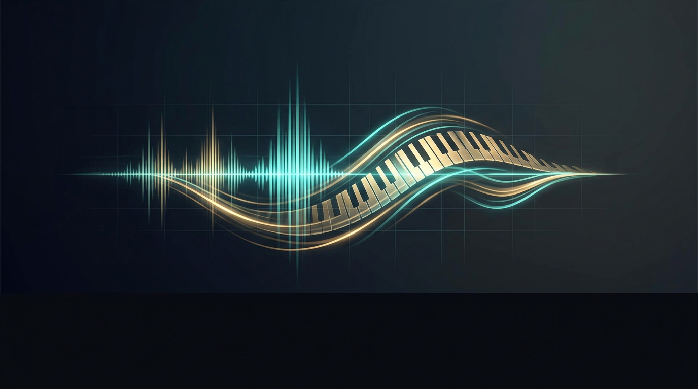

<!-- GitHub metadata: topics should be set in repo Settings > About -->
<!-- Suggested topics: daw, digital-audio-workstation, audio, music-production, midi, piano-roll, vst, qt6, juce, tracktion-engine, cpp, windows, open-source, audio-editor, music-software -->

<div align="center">

# OpenDaw

**A free, open-source Digital Audio Workstation for Windows, macOS, and Linux**

[](https://github.com/glenwrhodes/OpenDaw/releases/latest)

[](LICENSE)
[](https://github.com/glenwrhodes/OpenDaw/releases/latest)
[](https://github.com/glenwrhodes/OpenDaw/releases/latest)
[](https://github.com/glenwrhodes/OpenDaw/releases/latest)
[](https://en.cppreference.com/w/cpp/20)
[](https://www.qt.io/)
[](CONTRIBUTING.md)

Built with **Qt 6** for the UI and **Tracktion Engine** (JUCE) for the audio backend.
Audio and MIDI tracks, a built-in piano roll, sheet music notation, a destructive audio clip editor, VST3 instrument support, bus routing, 8 built-in effects, an **AI assistant powered by Claude** — all free and open source.

<br>



</div>

<br>

<div align="center">

<br>
<em>Signal routing view — drag cables between inputs, tracks, buses, and outputs</em>
</div>

---

## Download

Grab the latest release from the **[Releases page](https://github.com/glenwrhodes/OpenDaw/releases/latest)**:

| Download | Platform | Description |
|----------|----------|-------------|
| **OpenDaw-v*x.x.x*-setup.exe** | Windows | Installer with Start Menu shortcut and uninstaller |
| **OpenDaw-v*x.x.x*-portable.zip** | Windows | Portable build — unzip and run, no installation needed |
| **OpenDaw-v*x.x.x*-mac.dmg** | macOS | Disk image — open and drag to Applications |
| **OpenDaw-v*x.x.x*-linux-x86_64.AppImage** | Linux | AppImage — `chmod +x` and run, no installation needed |

---

## Features

### Timeline / Arrangement

- Starts with **4 audio tracks** by default
- Multi-track audio and MIDI arrangement with horizontal scrolling
- Drag-and-drop audio files (`.wav`, `.mp3`, `.flac`, `.ogg`, `.aiff`) and MIDI files (`.mid`, `.midi`) from the built-in file browser onto any track
- Waveform display on audio clips; note preview on MIDI clips
- Move clips by dragging -- snaps to the grid horizontally and locks to track lanes vertically
- Move clips between tracks by dragging up/down
- Split clips at the playhead (S key or toolbar button)
- Delete selected clips (Delete / Backspace)
- Clip context menu: Edit in Piano Roll, Quantize, Duplicate, Delete
- Timeline context menu: Add Audio Track, Add MIDI Track, Create Empty MIDI Clip, Remove Track
- Grid snapping with 5 modes: Off, 1/4 Beat, 1/2 Beat, Beat, Bar
- Horizontal and vertical zoom (Ctrl+= / Ctrl+-)
- Animated playhead cursor that tracks playback in real time

### MIDI & Piano Roll

- Add MIDI tracks via Edit > Add MIDI Track (Ctrl+Shift+T)
- Create empty MIDI clips or import `.mid` / `.midi` files by dragging them onto a track
- Multi-track MIDI file import with automatic merge
- Full **Piano Roll editor** (docked as a tab alongside the Mixer):
  - Add notes with Ctrl+click or double-click
  - Move and resize notes by dragging
  - Delete notes with Delete / Backspace
  - Select all notes (Ctrl+A)
  - Quantize notes to grid
  - Velocity lane for per-note velocity editing
  - Snap modes: Off, 1/4 Beat, 1/2 Beat, Beat, Bar
  - Zoom in / out
  - Right-click context menu: Select All, Delete Selected, Quantize, Add Note Here

<div align="center">

<br>
<em>Piano Roll — edit MIDI notes, velocity, and timing with snap-to-grid precision</em>
</div>

### Sheet Music View

- Renders MIDI clips as standard music notation in a dedicated **Sheet Music** tab (alongside the Mixer, Piano Roll, and other bottom panels)
- Grand staff display with treble and bass clefs, proper beam grouping, and ledger lines
- Automatic note spelling with key signature support — choose from all 15 major/minor key signatures via a toolbar dropdown
- Correctly quantizes MIDI note durations to whole, half, quarter, eighth, and sixteenth notes (with dotted variants)
- Rests are automatically inserted to fill gaps in each measure
- Measure numbers and bar lines for easy orientation
- Zoom slider to adjust the horizontal scale
- Scrollable score area with click-and-drag panning for navigating longer pieces
- Opens automatically when you double-click a MIDI clip (alongside the Piano Roll)

<div align="center">

<br>
<em>Sheet Music View — see your MIDI clips rendered as standard notation with key signatures and proper engraving</em>
</div>

### Audio Clip Editor

- Dedicated waveform editor for audio clips — double-click any audio clip to open the **Audio Clip** tab at the bottom
- **Destructive editing** with full undo/redo — edits modify the source audio file directly, with a warning banner and confirmation prompt
- Waveform display with time-based selection (click and drag to select regions)
- Snap modes: Off, Beat, Bar
- Mini transport controls: play from start, play/pause, stop, with real-time position display
- Non-destructive gain slider with normalize and bake-gain buttons
- Loop toggle, reverse toggle, and auto-tempo detection
- Selection-based editing operations:
  - Cut, Copy, Paste, Delete selection
  - Silence selection
  - Fade in / Fade out
  - Normalize selection
  - Reverse selection
  - Adjust volume
  - Insert silence
  - DC offset removal
  - Swap channels / Mix to mono
  - Crossfade
- Bake clip fades into the audio file
- Info bar showing BPM, beat count, duration, format (sample rate / bit depth), and file path

<div align="center">

<br>
<em>Audio Clip Editor — destructive waveform editing with cut, fade, normalize, reverse, and more</em>
</div>

### VST3 Instrument Support

- Scan for installed VST3 plugins (Edit > Scan VST Plugins)
- Plugin list cached to `%AppData%/OpenDaw/plugin-cache.xml`
- Assign VST3 instruments to MIDI tracks via a searchable selector dialog
- Open native plugin editor windows for full parameter control
- Instrument button on MIDI track headers and mixer channel strips (click to open editor, right-click to change instrument)

### Transport

- Play, Stop, Record, and Loop buttons
- Click the time ruler to jump the playhead (snaps to grid)
- Click and drag the ruler to scrub smoothly without snapping
- BPM control (20-300 BPM)
- Time signature control (numerator / denominator)
- Dual position display: elapsed time (mm:ss.ms) and bars.beats.ticks

### Track Headers (left panel)

- Per-track controls: name, Mute (M), Solo (S), Record Arm (R), Mono/Stereo toggle
- Track type badge: **AUDIO**, **MIDI**, or **BUS**
- Input source selector and output destination selector (Master or any bus)
- Instrument button on MIDI tracks (opens VST editor)
- Horizontal volume slider and pan knob per track
- Real-time level meters (green/yellow/red) that react to playback audio
- Vertically synchronized with the timeline scroll

### Mixer (bottom panel)

- Channel strip per track with: vertical volume fader, pan knob, Mute/Solo/Record Arm, level meter
- Bus channel strips alongside regular tracks
- Master channel strip on the right
- Instrument selector on MIDI track channel strips
- Two FX insert slots per track (quick-add Reverb, EQ, Compressor)
- Always left-aligned, horizontally scrollable

### Built-in Effects

Add any of these to a track with one click from the Effects panel or mixer FX slots:

| Effect | Description |
|--------|-------------|
| Reverb | Room size, damping, wet/dry |
| EQ | 4-band equalizer with per-band gain |
| Compressor | Threshold, ratio, attack, release |
| Delay | Delay time, feedback, mix |
| Chorus | Rate, depth, mix |
| Phaser | Rate, depth, feedback |
| Low Pass Filter | Cutoff frequency |
| Pitch Shift | Semitone shift |

### Routing View (bottom panel, tabbed)

- Visual node-based signal routing with drag-and-drop cable connections
- Five column layout: **Input Channels → Tracks → Buses → Master → Output Channels**
- Color-coded cables show signal flow at a glance
- **Bus tracks** — create buses to submix groups of tracks, with independent effects processing
- Route any track's output to Master or to a bus
- Sidechain input support on bus tracks
- Rename input devices with custom labels
- Auto-layout button or freely drag nodes to arrange the view
- Right-click cables to disconnect; right-click empty space to add buses
- Node positions persist across sessions
- Zoom and pan navigation

### Effects Panel (right panel, tabbed)

- Select a track to see and edit its effect chain
- Add effects via the "+ Add Effect" button and dialog
- Per-effect bypass and remove controls
- Rotary knobs for up to 4 parameters per effect

### File Browser (right panel, tabbed)

- Browse your file system filtered to audio and MIDI files
- Quick-jump locations: Desktop, Music, Documents, Home
- Drag files directly from the browser onto timeline tracks

### AI Assistant — Your Studio Co-Engineer

OpenDaw ships with a built-in **AI assistant powered by Anthropic's Claude** that can control the entire DAW through natural language. This isn't a chatbot that tells you what buttons to click — it actually **executes operations directly** on your project, calling up to 30 different tools in an autonomous loop until your request is fulfilled.

Press **Ctrl+Shift+Space** from anywhere to open the quick prompt overlay, type what you need, and watch it happen.

<div align="center">

<br>
<em>AI Assistant — describe what you want in plain English and watch it build tracks, compose MIDI, set up routing, and more</em>
</div>

#### Why it matters

Most DAW workflows involve dozens of repetitive clicks: creating tracks, naming them, setting up routing, dialing in effects. The AI assistant collapses these into a single sentence. It reads your current project state — every track name, every effect chain, every routing connection — and figures out the right sequence of operations to get you where you want to be.

#### Session setup in seconds

Skip the tedious part of starting a new project. Describe what you need and the AI builds it:

> *"I'm recording a jazz quartet. Set up tracks for upright bass, piano, drums, and tenor sax. Route them all to master. Add a light reverb to every track and set the tempo to 132 BPM in 4/4."*

The AI creates four named tracks, adds reverb to each one, sets the tempo, and confirms what it did — all in one go. What would take 30+ clicks takes one sentence.

> *"Set up a full orchestra template: Violins 1, Violins 2, Violas, Cellos, Basses, Flutes, Oboes, Clarinets, Bassoons, French Horns 1-2, Trumpets 1-2, Trombones 1-2, Tuba, Timpani, Harp, and Percussion. Create a Strings bus and a Brass bus. Route the string sections to the Strings bus and the brass to the Brass bus."*

Twenty-plus tracks, two buses, and all routing — done before you could have right-clicked twice.

#### Bulk editing without the tedium

Make sweeping changes across your entire project with plain English:

> *"Mute everything except the vocals and drums."*

> *"Set all tracks to -6 dB and pan the guitars hard left and right."*

> *"Rename every track by adding 'Session 3 - ' to the front of each name."*

> *"Solo only Track 1 and Track 4."*

The AI reads the current state, figures out which tracks need changing, and calls the right tools for each one.

#### Sound design by description

You don't need to know that the reverb's "room size" parameter is at index 0 and normalized to 0.0–1.0. Just describe what you want to hear:

> *"Make the reverb on the vocal track sound much longer and more ethereal."*

The AI inspects the current reverb parameters, understands that "longer" means increasing room size and decay, and "ethereal" means pushing wet mix higher while reducing damping — then sets the values accordingly.

> *"The delay on the guitar feels too busy. Reduce the feedback and pull back the mix."*

> *"Add a compressor to the drum bus. Set it up for gentle glue — low ratio, medium attack, fast release."*

> *"Bypass all the effects on Track 3 so I can hear it dry."*

#### Routing and signal flow

Building complex routing by dragging cables is powerful but slow. The AI handles it conversationally:

> *"Create a bus called 'Reverb Send' and route tracks 1, 2, and 5 to it."*

> *"Move the bass and kick drum to a new 'Low End' bus."*

> *"Disconnect the output on every track except the master bus."*

> *"What are my available input devices? Assign the first one to Track 1."*


#### MIDI composition and arrangement

This is where OpenDaw's AI goes far beyond any traditional DAW assistant. You can describe musical ideas in plain English and the AI will **compose and write actual MIDI notes** directly into your project — no scripting, no templates, no manual entry.

Under the hood, the AI uses `create_midi_clip` and `add_midi_notes` to place real notes with precise pitch, timing, duration, and velocity into your piano roll. It understands music theory and translates your intent into actual note data.

> *"Create a string arrangement for the chord progression C, Am, F, G. Four bars, lush and cinematic."*

The AI creates MIDI tracks for Violins, Violas, and Cellos, works out the correct chord voicings and inversions for each part, adds movement and passing tones so the arrangement breathes, and writes all the notes directly into the piano roll — ready to play back immediately with your VST strings.

> *"Write a bass line following the root notes of C, Am, F, G over two bars. Eighth notes, punchy."*

> *"Harmonize that melody with thirds above it on a new MIDI track."*

> *"Add an arpeggiated piano part over the C Am F G progression — broken chords, gentle, three beats per chord."*

> *"Double the violin line an octave lower on a cello track."*

The AI knows which notes belong to each chord, how to voice them across registers, and how to make an arrangement feel intentional rather than mechanical. It can also read your existing MIDI clips and build on what you already have.

**More composition scenarios:**

> *"I have a 4-bar loop with drums and bass. Add a Rhodes piano comping Em, D, C, G in a syncopated style."*

> *"Generate an 8-bar melody over C major that peaks at bar 5 then resolves."*

> *"Create a countermelody that responds to the main melody on Track 2."*

> *"Set up a full string section: Violin 1, Violin 2, Viola, Cello, Bass — each on its own MIDI channel."*

This is real MIDI note generation backed by actual tool calls — not suggestions, not instructions on what to click. The notes appear in your piano roll, ready to edit, play, and export.
#### Project housekeeping

Keep your session organized without breaking flow:

> *"Delete all the empty tracks."*

> *"What effects are on each track? Give me a summary."*

> *"Save the project."*

> *"Undo that last change."*

> *"What's the current tempo and time signature?"*

#### Teaching and exploration

The AI knows what tools it has and can explain your project to you:

> *"I'm new to mixing. Can you explain what each of my tracks is doing right now?"*

> *"What effects do I have available?"*

> *"Walk me through a basic mixing approach for my 8-track rock session."*

Because it can read your actual project state, its advice is grounded in what you really have — not generic suggestions.

#### How it works under the hood

The assistant uses **agentic tool use**: when you send a message, it decides which tools to call, executes them, reads the results, and continues calling more tools if needed — up to 20 rounds per request. It's not scripted or template-based; it reasons about your request and your project state dynamically.

**30 tools** cover the full surface of the DAW:

| Category | Tools |
|----------|-------|
| **Track management** | Create audio/MIDI/bus tracks, delete, rename |
| **Track properties** | Mute, solo, volume, pan, mono, record arm |
| **Routing** | Assign inputs, set outputs to master or buses, disconnect |
| **Effects** | Add/remove built-in effects, set parameters, bypass |
| **Transport** | Play, stop, record, seek, tempo, time signature |
| **Project** | Save, undo, redo, get project info |

**Key features:**
- **Streaming responses** — tokens appear word-by-word as the AI thinks, so you see progress immediately
- **True agentic behavior** — the AI calls tools, inspects results, and loops until the task is complete
- **Destructive action safety** — optionally prompts for confirmation before deleting tracks or removing effects (on by default)
- **Tool output toggle** — click "Tools: OFF/ON" to show or hide detailed tool call information (off by default for a clean experience)
- **Dynamic project awareness** — the system prompt is rebuilt with your current project state at each conversation, so the AI always knows exactly what tracks, effects, and routing you have
- **Conversation memory** — the AI remembers what you've discussed and done within a session
- **Privacy-first** — bring your own Anthropic API key, stored locally in app settings, never sent anywhere except Anthropic's API

### Project Management

- File > New Project -- start fresh with 4 empty audio tracks
- File > Open Project -- load a `.tracktionedit` file
- File > Save / Save As -- save your arrangement
- Edit > Add Audio Track / Add MIDI Track / Remove Selected Track
- View > Toggle Mixer, Toggle Routing, Toggle Browser, Toggle Effects, Toggle AI Assistant, Toggle Sheet Music

---

## Prerequisites

You need the following installed on Windows:

| Tool | Version | Notes |
|------|---------|-------|
| **Visual Studio 2022** | Community or higher | Provides the MSVC C++ compiler |
| **Qt 6.8+** | MSVC 2022 64-bit kit | Install via [Qt Online Installer](https://www.qt.io/download-qt-installer) or `aqtinstall` |
| **CMake** | 3.22+ | Bundled with Qt at `c:\qt\Tools\CMake_64\` |
| **Ninja** | 1.10+ | Bundled with Qt at `c:\qt\Tools\Ninja\` |
| **Git** | 2.x | For cloning and submodule management |

### Installing Qt MSVC kit via command line (optional)

If you only have the MinGW Qt kit, you can add the MSVC kit without the Qt Maintenance Tool:

```powershell
pip install aqtinstall
aqt install-qt windows desktop 6.10.2 win64_msvc2022_64 --outputdir c:\qt
```

---

## Building

All commands are for **PowerShell on Windows**.

### 1. Clone the repository with submodules

```powershell
git clone --recurse-submodules https://github.com/grhod/AudioMixer.git
cd AudioMixer
```

If you already cloned without submodules:

```powershell
git submodule update --init --depth 1
```

### 2. Check out the correct JUCE version

Tracktion Engine requires a specific JUCE commit. After cloning:

```powershell
cd libs/JUCE
git fetch origin 7c89e11f6b7316c369f3d3f22227c60e816e738b
git checkout 7c89e11f6b7316c369f3d3f22227c60e816e738b
cd ../..
```

### 3. Configure with CMake

This must be run from a Visual Studio Developer Command Prompt (or use the `vcvarsall.bat` wrapper below):

```powershell
cmd /c "`"C:\Program Files\Microsoft Visual Studio\2022\Community\VC\Auxiliary\Build\vcvarsall.bat`" x64 && c:\qt\Tools\CMake_64\bin\cmake.exe -B build -G Ninja -DCMAKE_PREFIX_PATH=c:/qt/6.10.2/msvc2022_64 -DCMAKE_C_COMPILER=cl -DCMAKE_CXX_COMPILER=cl -DCMAKE_MAKE_PROGRAM=c:/qt/Tools/Ninja/ninja.exe"
```

Adjust paths if your Qt or Visual Studio installation differs.

### 4. Build

```powershell
cmd /c "`"C:\Program Files\Microsoft Visual Studio\2022\Community\VC\Auxiliary\Build\vcvarsall.bat`" x64 && c:\qt\Tools\CMake_64\bin\cmake.exe --build build"
```

The first build takes 2-4 minutes (compiling JUCE and Tracktion Engine). Subsequent rebuilds are fast (10-15 seconds).

### Quick Build Script

Instead of the manual steps above, you can use the included `build.ps1` PowerShell script:

```powershell
# Incremental build (fast, ~10-15 seconds)
.\build.ps1

# Full reconfigure + build (needed after CMakeLists.txt changes or new git tags)
.\build.ps1 -Clean
```

The script automatically sets up the MSVC environment, configures if needed, and builds. It will also kill any running OpenDaw instance before building. Use `-Clean` after updating a git tag so the new version number gets picked up.

### 5. Run

```powershell
# Add Qt DLLs to PATH for runtime
$env:PATH = "c:\qt\6.10.2\msvc2022_64\bin;" + $env:PATH

# Launch
.\build\OpenDaw_artefacts\Debug\OpenDaw.exe
```

Or deploy Qt DLLs alongside the executable:

```powershell
c:\qt\6.10.2\msvc2022_64\bin\windeployqt.exe .\build\OpenDaw_artefacts\Debug\OpenDaw.exe
.\build\OpenDaw_artefacts\Debug\OpenDaw.exe
```

---

## How to Use OpenDaw

### Getting started

1. **Launch OpenDaw.** The window opens with 4 empty audio tracks, a transport bar at the top, track headers on the left, the timeline in the center, the mixer at the bottom, and the file browser / effects panel tabbed on the right.

2. **Set your tempo.** In the transport bar, adjust the BPM spinner (default 120). Change the time signature with the two spinners next to it (default 4/4).

3. **Set your snap mode.** Use the "Snap" dropdown in the transport bar to choose grid resolution: Beat (default), Bar, 1/2 Beat, 1/4 Beat, or Off.

### Adding audio to the timeline

1. In the **Browser** tab (right panel), navigate to a folder containing audio or MIDI files. Use the dropdown at the top for quick access to Desktop, Music, Documents, or Home.

2. **Drag an audio file** (`.wav`, `.mp3`, `.flac`, `.ogg`, `.aiff`) or **MIDI file** (`.mid`, `.midi`) from the browser and **drop it onto a track lane** in the timeline. The clip will snap to the grid at the drop position.

3. Audio clips display their waveform; MIDI clips display a note preview. You can **drag any clip** to reposition -- it snaps horizontally to the grid and vertically to track lanes.

4. To **add more tracks**, go to Edit > Add Audio Track (Ctrl+T) or Edit > Add MIDI Track (Ctrl+Shift+T).

### Playback

- Click **Play** (or press Space) to start playback from the current playhead position.
- Click **Stop** to stop and return the playhead to the beginning.
- **Click on the time ruler** (the bar/beat numbers at the top) to jump the playhead to that position (snapped to grid).
- **Click and drag on the ruler** to scrub smoothly through the timeline.
- Toggle **Loop** to loop playback over the current region.

### Mixing

Each track has controls in two places:

**Track headers (left of timeline):**
- **M** -- Mute the track
- **S** -- Solo the track (only this track plays)
- **R** -- Arm for recording
- **Mono/Stereo** toggle -- switch between mono and stereo processing
- **Input selector** -- choose an audio input device
- **Output selector** -- route to Master or any bus track
- **Volume slider** -- horizontal, adjusts track volume
- **Pan knob** -- drag up/down to pan left/right
- **Level meter** -- shows real-time audio level (green = good, yellow = hot, red = clipping)

**Mixer panel (bottom):**
- Same controls in a traditional vertical channel strip layout
- **Volume fader** -- vertical, drag up/down
- **Pan knob** -- rotary control
- **FX 1 / FX 2** dropdowns -- quick-add Reverb, EQ, or Compressor
- **Master strip** on the far right -- controls overall output level

### Routing

1. Switch to the **Routing** tab (tabbed alongside the Mixer, Piano Roll, Audio Clip, and Sheet Music at the bottom).
2. The view shows your signal chain as draggable nodes: input channels on the left, tracks in the middle, buses and master on the right, and output channels on the far right.
3. **Create a bus** by clicking the "+ Add Bus" button in the toolbar, or right-click empty space and select "Add Bus".
4. **Connect tracks to a bus** by dragging a cable from a track's OUT jack to a bus's IN jack, or use the output selector dropdown on the track header.
5. **Add effects to a bus** using the Effects panel — select the bus track first, then add effects.
6. **Rearrange nodes** by dragging them freely. Click "Auto Layout" to reset positions.
7. **Remove a cable** by right-clicking it and selecting "Disconnect".

### Working with MIDI

1. **Add a MIDI track** via Edit > Add MIDI Track (Ctrl+Shift+T).
2. **Create a MIDI clip** by right-clicking a MIDI track lane and selecting "Create Empty MIDI Clip", or drag a `.mid` file from the browser.
3. **Open the Piano Roll** by double-clicking a MIDI clip (or right-click > Edit in Piano Roll).
4. **Add notes** with Ctrl+click or double-click on the grid. **Drag** notes to move them, **drag edges** to resize.
5. **Edit velocity** in the velocity lane at the bottom of the Piano Roll -- drag the bars up/down.
6. **Quantize** notes from the right-click context menu or the Piano Roll toolbar.
7. **View as sheet music** — switch to the **Sheet Music** tab at the bottom to see your MIDI clip rendered as standard notation. Use the key signature dropdown to change enharmonic spelling.

### Editing audio clips

1. **Double-click an audio clip** in the timeline to open the **Audio Clip** tab at the bottom.
2. The waveform editor shows the full audio file. **Click and drag** to select a region.
3. Use the toolbar buttons for **Cut, Copy, Paste, Silence, Fade In/Out, Normalize, Reverse**, and more.
4. Edits are **destructive** (they modify the source file) but fully undoable — the editor maintains its own undo/redo stack.
5. Adjust the non-destructive **Gain** slider, or click **Norm** to normalize, then **Bake** to write the gain into the file.
6. The info bar at the bottom shows BPM, duration, sample rate, bit depth, and the source file path.

### Using VST3 instruments

1. **Scan for plugins** via Edit > Scan VST Plugins. This only needs to be done once (results are cached).
2. **Assign an instrument** to a MIDI track by clicking the instrument button on the track header or mixer channel strip.
3. **Open the plugin editor** by clicking the instrument button on a MIDI track that already has an instrument assigned. Right-click to change the instrument.

### Adding effects

**Quick method:** In the mixer, use the FX 1 or FX 2 dropdown on any track's channel strip and select Reverb, EQ, or Compressor.

**Full method:**
1. Click on an FX dropdown in the mixer to open the **Effects** tab in the right panel.
2. Click **+ Add Effect** to open the effect selector dialog.
3. Choose from 8 built-in effects and click OK (or double-click).
4. The effect appears with parameter knobs. Adjust to taste.
5. Click **Byp** to bypass an effect, or **X** to remove it.

### Using the AI Assistant

1. **Set your API key.** Click the **AI** tab in the right panel, then click **Settings**. Enter your Anthropic API key (`sk-ant-...`) and click OK. The key is stored locally and only sent to Anthropic's API.

2. **Quick prompt (Ctrl+Shift+Space).** Press Ctrl+Shift+Space from anywhere in the app. A floating text input appears — type your request and press Enter. The AI panel opens and the assistant begins working.

3. **Chat panel.** Click the **AI** tab on the right panel to open the full chat interface. Type in the input box at the bottom and press Enter (or click Send). Shift+Enter adds a new line.

4. **Watch it work.** The AI streams its response in real time. If tools are needed (creating tracks, changing settings, adding effects), it calls them automatically and continues until the task is done.

5. **Tool output toggle.** Click the **Tools: OFF** button in the header to see detailed tool call information — useful for understanding exactly what the AI did. Toggle it back off for a cleaner view.

6. **Destructive action safety.** By default, the AI will ask for confirmation before deleting tracks or removing effects. You can toggle this in Settings.

7. **Clear conversation.** Click **Clear** to start a fresh conversation. The AI will re-read your current project state at the start of the next message.

### Saving and loading

- **File > Save As** (Ctrl+Shift+S) -- save your project as a `.tracktionedit` file.
- **File > Save** (Ctrl+S) -- save to the current file.
- **File > Open** (Ctrl+O) -- load a previously saved project.
- **File > New** (Ctrl+N) -- start a fresh empty project.

### Keyboard shortcuts

**Global**

| Shortcut | Action |
|----------|--------|
| Space | Play / Pause |
| R | Record |
| S | Split clip at playhead |
| Delete / Backspace | Delete selected clips |
| Ctrl+T | Add audio track |
| Ctrl+Shift+T | Add MIDI track |
| Ctrl+N | New project |
| Ctrl+O | Open project |
| Ctrl+S | Save project |
| Ctrl+Shift+S | Save As |
| Ctrl+Q | Quit |
| Ctrl+= | Zoom in (timeline) |
| Ctrl+- | Zoom out (timeline) |
| Ctrl+Shift+Space | Open AI quick prompt |

**Piano Roll**

| Shortcut | Action |
|----------|--------|
| Ctrl+click / Double-click | Add note |
| Delete / Backspace | Delete selected notes |
| Ctrl+A | Select all notes |

---

## Project Structure

```
AudioMixer/
  CMakeLists.txt                          Root build configuration
  README.md                               This file
  LICENSE                                 GPLv3 license
  CONTRIBUTING.md                         Contribution guidelines
  .github/
    workflows/
      release.yml                         CI/CD: build + release on tag push
  installer/
    OpenDaw.iss                           Inno Setup installer script
  resources/
    splash.png                            Splash screen artwork
    routing-view.png                      Routing view screenshot
    piano-roll.png                        Piano roll screenshot
    sheet-music-view.png                  Sheet music view screenshot
    audio-clip-editor.png                 Audio clip editor screenshot
    ai-assistant.png                      AI assistant panel screenshot
  libs/
    JUCE/                                 JUCE framework (git submodule)
    tracktion_engine/                     Tracktion Engine (git submodule)
  src/
    main.cpp                              Entry point, JUCE-Qt bridge
    app/
      OpenDawApplication.h/cpp            Application lifecycle
      JuceQtBridge.h/cpp                  QTimer-based JUCE message pump
    engine/
      AudioEngine.h/cpp                   Wraps tracktion::engine::Engine, MIDI device enumeration
      EditManager.h/cpp                   Manages the current Edit (project)
      PluginScanner.h/cpp                 VST3 plugin scanning and cache
    ui/
      MainWindow.h/cpp                    Main window with menus, docks, toolbar
        SplashScreen.h/cpp                Borderless splash screen (click to dismiss)
      timeline/
        TimelineView.h/cpp                Arrangement view with track headers
        TimeRuler.h/cpp                   Beat/bar ruler with click and drag
        TrackHeaderWidget.h/cpp           Per-track controls, level meter, instrument button
        TrackLane.h/cpp                   Track lane data model
        ClipItem.h/cpp                    Audio/MIDI clip with snapped dragging
        GridSnapper.h/cpp                 Snap-to-grid logic
      pianoroll/
        PianoRollEditor.h/cpp             Piano roll dock widget container
        NoteGrid.h/cpp                    Note editing grid (add, move, resize, delete)
        NoteItem.h/cpp                    Individual MIDI note graphics item
        VelocityLane.h/cpp                Per-note velocity editor
        PianoKeyboard.h/cpp               Piano keyboard sidebar
      sheetmusic/
        SheetMusicView.h/cpp              Sheet music tab container with toolbar
        NotationModel.h/cpp               MIDI-to-notation model (measures, beams, rests)
        ScoreScene.h/cpp                  QGraphicsScene renderer for engraved notation
      audioclip/
        AudioClipEditor.h/cpp             Audio clip editor tab with destructive editing
        AudioWaveformView.h/cpp           Zoomable waveform display with selection
        AudioFileOperations.h/cpp         Cut, fade, normalize, reverse, etc.
        AudioFileUndoManager.h/cpp        Undo/redo stack for destructive file edits
      mixer/
        MixerView.h/cpp                   Horizontal mixer panel
        ChannelStrip.h/cpp                Per-track mixer strip with instrument selector
      transport/
        TransportBar.h/cpp                Play/Stop/Record/Loop/BPM controls
      controls/
        RotaryKnob.h/cpp                  Custom painted rotary knob
        VolumeFader.h/cpp                 Custom painted vertical fader
        LevelMeter.h/cpp                  Animated green/yellow/red level meter
        WaveformWidget.h/cpp              Waveform rendering widget
      effects/
        EffectChainWidget.h/cpp           Per-track effect chain editor
        EffectSelectorDialog.h/cpp        Effect picker dialog
        PluginEditorWindow.h/cpp          Native VST plugin editor window
        VstSelectorDialog.h/cpp           Searchable VST instrument selector
      routing/
        RoutingView.h/cpp                 Node-based signal routing view
        RoutingNode.h/cpp                 Draggable routing node (input/track/bus/master/output)
        CableItem.h/cpp                   Color-coded cable connecting jacks
      browser/
        FileBrowserPanel.h/cpp            File system browser with drag support
    ai/
      AiTypes.h                           Shared types: messages, tool calls, roles
      AiToolDefs.h/cpp                    30 tool JSON schemas for Anthropic API
      AiToolExecutor.h/cpp                Dispatches tool calls to engine APIs
      AiService.h/cpp                     Anthropic API client with SSE streaming
      AiChatWidget.h/cpp                  Chat panel UI with streaming & markdown
      AiQuickPrompt.h/cpp                 Ctrl+Shift+Space overlay prompt
    utils/
      WaveformCache.h/cpp                 Audio file waveform thumbnail cache
      ThemeManager.h/cpp                  Dark theme color management
```

## Architecture

OpenDaw bridges two frameworks:

- **Qt 6 Widgets** handles all GUI rendering, layout, and user interaction
- **Tracktion Engine** (built on JUCE) handles all audio: playback, recording, effects processing, plugin hosting, and the project data model

A `QTimer` pumps JUCE's `MessageManager` every 10ms from Qt's event loop, allowing both frameworks to coexist. Tracktion Engine's audio processing runs on its own real-time thread, independent of either GUI event loop.

---

## Contributing

Contributions are welcome! Whether it's bug reports, feature requests, or pull requests — all help is appreciated.

See **[CONTRIBUTING.md](CONTRIBUTING.md)** for details on how to get started, coding conventions, and the PR process.

---

## License

This project is licensed under the **GNU General Public License v3.0** — see the [LICENSE](LICENSE) file for details.

OpenDaw uses [Tracktion Engine](https://github.com/Tracktion/tracktion_engine) (GPLv3) and [JUCE](https://juce.com/) (AGPLv3), both of which are compatible with this license.

---

<div align="center">

Made with care for musicians and producers everywhere.

If OpenDaw is useful to you, consider giving it a star on GitHub.

</div>


